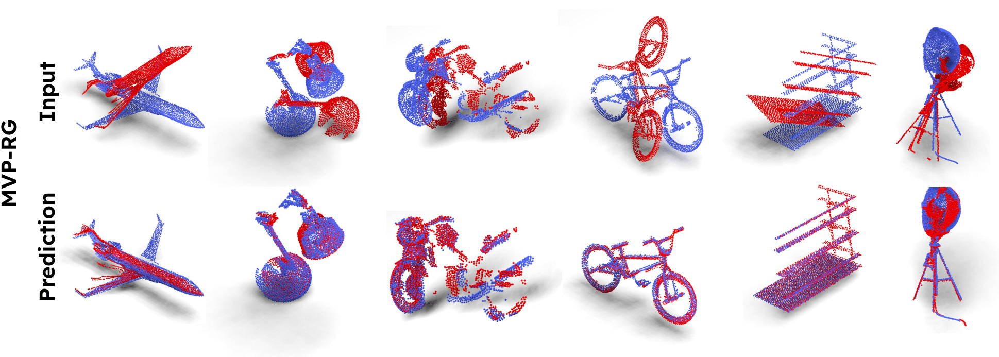

# LoGDesc: local geometric features aggregation for robust point cloud registration
To test this code on the MVP-RG dataset, please follow the steps below :

1. Download the pre-trained model [here](https://cloud.isir.upmc.fr/s/2yYXiFDyLiKPcHj)
2. Place it in a folder called **pre-trained/**
3. Download the MVP-RG data files ( MVP_Train_RG.h5  and MVP_Test_RG.h5 ) from [here](https://github.com/paul007pl/MVP_Benchmark/tree/main/registration)
4. Place them in **MVP_RG/registration/data/**
5. Run the following :


```
python mvp_test.py

```

You can add the arg :  --use_kpt = T  to select the topk points to be used in the transformer and the pose estimation.





## Acknowledgement

Some parts of this code are adapted from : 

[MDGAT](https://github.com/chenghao-shi/MDGAT-matcher)
[GeoTransformer](https://github.com/qinzheng93/GeoTransformer)
[RepSurf](https://github.com/hancyran/RepSurf)
[PRNet](https://github.com/WangYueFt/prnet)
[GMCNET](https://github.com/paul007pl/GMCNet)
[Lepard](git@github.com:rabbityl/lepard.git)
 
Please consider citing their paper.


```
This work was supported by the French ANR program MARSurg (ANR-21-CE19-0026).

```
